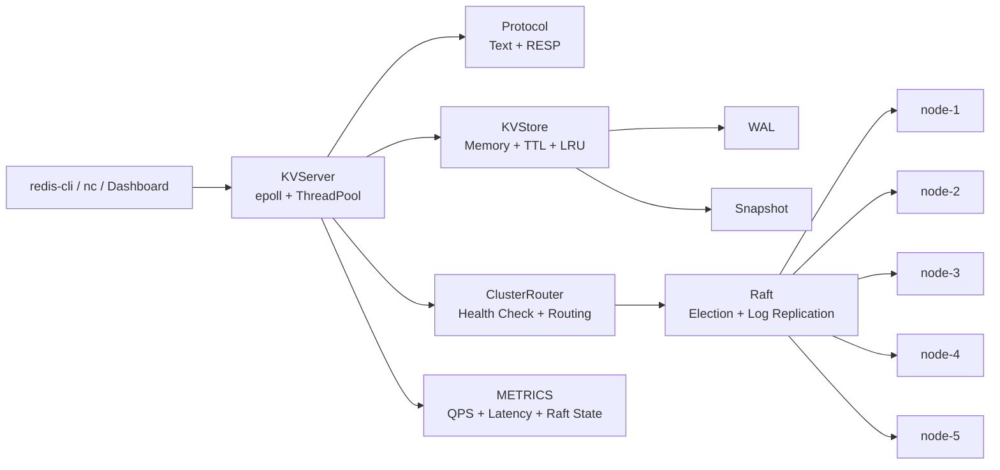
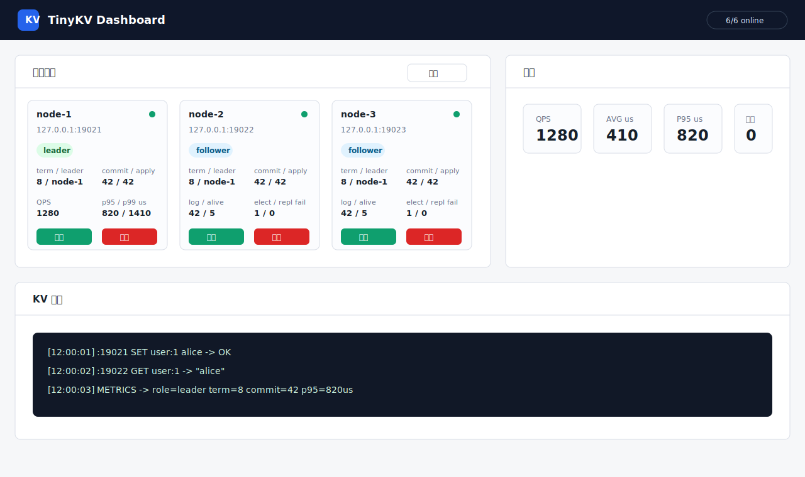

# TinyKVServer

[](https://github.com/Lynnhu23/KV-/actions/workflows/ci.yml)

C++20 实现的轻量级分布式 KV 存储原型。

当前能力：

- 文本 KV 协议：`PING`、`PUT`、`GET`、`DEL`、`EXISTS`
- RESP 协议：兼容 Redis 客户端常用命令 `PING`、`SET`、`GET`、`DEL`、`EXISTS`
- 单机内存 KV 存储
- WAL + Snapshot 持久化恢复
- TTL 过期键
- LRU 内存淘汰
- 一致性哈希路由
- 健康检查与存活节点路由
- 多副本复制
- Raft leader 选举、心跳、日志复制与多数派提交
- 多节点请求转发
- 同步/异步日志
- YAML 配置
- benchmark 压测工具

## Architecture



## Screenshot



## Build

```bash
make kvserver
```

## Run

单节点：

```bash
./kvserver -f configs/kvserver.yaml
```

覆盖端口：

```bash
./kvserver -f configs/kvserver.yaml -p 19006
```

五节点本地集群：

```bash
make run-cluster
```

也可以分别启动：

```bash
make run-cluster-1
make run-cluster-2
make run-cluster-3
make run-cluster-4
make run-cluster-5
```

或直接运行：

```bash
./kvserver -f configs/cluster-node1.yaml  # 127.0.0.1:19021
./kvserver -f configs/cluster-node2.yaml  # 127.0.0.1:19022
./kvserver -f configs/cluster-node3.yaml  # 127.0.0.1:19023
./kvserver -f configs/cluster-node4.yaml  # 127.0.0.1:19024
./kvserver -f configs/cluster-node5.yaml  # 127.0.0.1:19025
```

集群配置会定期健康检查 peer。默认五节点配置使用 Raft 模式，节点启动后会通过投票自动选出 leader，写入需要多数派确认后才返回成功。五节点集群至少需要 3 个节点存活才能选主和提交写入。

```yaml
cluster:
  replication_factor: 2
  health_check_interval_ms: 1000
  consistency: "raft"
  leader_id: "node-1"
```

Raft 模式包含任期、投票、leader 心跳、follower 自动转发到当前 leader、AppendEntries 日志复制、commitIndex/lastApplied 推进，以及 leader 写入多数派复制后提交。`leader_id` 只保留为兼容旧配置，实际 leader 由选举产生。

Raft 日志和元数据会持久化到节点 `data_dir`：

- `raft.meta`：当前 term 和 votedFor
- `raft.log`：已追加的 Raft log entry
- `raft.state`：commitIndex 和 lastApplied

RequestVote 会比较 candidate 的 `lastLogIndex/lastLogTerm`，避免日志落后的节点赢得选举。AppendEntries 支持批量 entry，follower 会校验 `prevLogIndex/prevLogTerm`，冲突时回退并重放。节点重启后会加载 Raft log/state，并恢复已提交状态。

Raft snapshot 支持 `lastIncludedIndex/lastIncludedTerm` offset 管理。节点 apply 的日志数量达到 `snapshot_threshold` 后，会将已应用日志压缩进状态机快照并截断 `raft.log`；当 follower 落后到 leader 已截断的日志之前，leader 会先发送 `RAFT_INSTALL_SNAPSHOT`，follower 安装快照后继续接收后续 AppendEntries。

## Persistence

默认单机配置启用 WAL 和 Snapshot：

```yaml
store:
  wal_enabled: true
  wal_file: "./data/node-1/kv.wal"
  snapshot_file: "./data/node-1/kv.snapshot"
  snapshot_threshold: 1000
  max_keys: 0
```

写入会先追加 WAL；每累计 `snapshot_threshold` 次写操作后生成一次
snapshot，并截断 WAL。重启恢复时先加载 snapshot，再 replay 新 WAL。

`max_keys` 控制 LRU 容量，`0` 表示不限制。超过容量时会淘汰最近最少使用的 key。

## Protocol

文本协议：

```text
PING
PUT <key> <value>
GET <key>
DEL <key>
EXISTS <key>
```

示例：

```bash
printf 'PUT user:1 alice\nGET user:1\n' | nc -q 0 127.0.0.1 9006
```

返回：

```text
OK
VALUE alice
```

RESP / Redis 客户端：

```bash
redis-cli -p 9006 ping
redis-cli -p 9006 set user:1 alice
redis-cli -p 9006 set session:1 token EX 60
redis-cli -p 9006 get user:1
redis-cli -p 9006 exists user:1
redis-cli -p 9006 ttl session:1
redis-cli -p 9006 del user:1
```

## Benchmark

启动服务后运行：

```bash
make bench
```

可覆盖参数：

```bash
make bench PORT=9006 REQUESTS=100000 CLIENTS=100
```

输出 QPS、平均延迟、p95 和 p99 延迟。

## Dashboard

启动 KVServer 后运行：

```bash
make dashboard
```

浏览器打开：

```text
http://127.0.0.1:8080
```

Dashboard 可以查看单机/五节点状态，执行 KV 命令、TTL 命令和本地压测。节点卡片会展示当前角色、term、leader、commitIndex/lastApplied、log size、snapshot lastIncludedIndex/Term、QPS、p95/p99 延迟、alive 节点数、选举次数和复制失败次数。

Dashboard 也可以直接启动/停止节点。页面的每个节点卡片都有启动/停止按钮；`启动 node-1~3` 会拉起 Raft 最小多数派。

Docker Compose 一键启动 Dashboard：

```bash
make compose-up
```

打开：

```text
http://127.0.0.1:8080
```

Compose 默认会自动启动 Dashboard 和 5 个 KV 节点。也可以在页面里手动停止/启动任意节点。停止 Compose：

```bash
make compose-down
```

没有 `redis-cli` 时可以直接发送 RESP 帧：

```bash
make demo-resp
```

## Test

```bash
make test
```

Raft 故障与一致性测试会自动启动临时 5 节点集群，覆盖多数派写入、少数派拒写、leader 故障重选、晚加入节点追日志、全节点重启恢复、snapshot 压缩和落后 follower 通过 snapshot 追赶：

```bash
make test-raft
```

## Fault Demo

启动 5 节点和 Dashboard：

```bash
make compose-up
```

写入一条数据：

```bash
redis-cli -p 19021 set demo:raft ok
redis-cli -p 19022 get demo:raft
```

在 Dashboard 里停止当前 `leader` 节点，等待 1-3 秒后刷新节点状态。新的 leader 选出后继续写入：

```bash
redis-cli -p 19023 set demo:after-failover yes
redis-cli -p 19024 get demo:after-failover
```

也可以直接运行自动化故障演示：

```bash
make test-raft
```

它会覆盖多数派写入、少数派拒写、leader 故障重选、晚加入节点追日志和全节点重启恢复。

## Repository Hygiene

仓库只提交源码、配置、测试、文档和 Docker/CI 文件。以下运行产物已通过 `.gitignore` 排除：

- `kvserver`、`bench`、`server`
- `tests/build/`
- `data/`
- `*.wal`、`*.snapshot`、`*.meta`、`*.state`
- `*_KVServerLog`、`*_ServerLog`

项目结构见 [docs/PROJECT_STRUCTURE.md](docs/PROJECT_STRUCTURE.md)。
